# app-dev-prompt-suite

A Claude Code plugin marketplace for spec-driven development workflows.

## Installation

```bash
# Add marketplace
/plugin marketplace add taakashifukada/app-dev-prompt-suite

# Install plugin
/plugin install app-dev-suite@app-dev-prompt-suite
```

## Available Plugins

| Plugin | Description |
|--------|-------------|
| [app-dev-suite](plugins/app-dev-suite/) | Spec-driven development workflow with deep research, feasibility study, solution design, and TDD implementation |

## Workflow Overview

```mermaid
flowchart LR
    D["/deep-research"] -. "research_report.md\n(-r flag)" .-> F["/feasibility-study"]
    F -- "feasibility_report.md" --> S["/solution-design"]
    S -- "solution_design.md" --> I["/implement-tdd"]
    I -- "implementation_report.md" --> G["/generate-slides"]

    style D fill:#f3e5f5,stroke:#9C27B0
    style F fill:#e8f4fd,stroke:#2196F3
    style S fill:#fff3e0,stroke:#FF9800
    style I fill:#e8f5e9,stroke:#4CAF50
    style G fill:#fce4ec,stroke:#E91E63
```



**Deep Research** (optional): Autonomous multi-task investigation with adaptive re-evaluation

**Phase 1 — Feasibility Study**: Codebase analysis, web research, solution candidates, optional PoC

**Phase 2 — Solution Design**: Subtask breakdown, dependency mapping, test case planning

**Phase 3 — TDD Implementation**: Test-driven development with per-subtask quality gates

**Slides**: Generate Marp presentation from phase artifacts for technical review

For quick tasks: `/app-dev-suite:small-feature` provides an all-in-one workflow.

## Repository Structure

```
app-dev-prompt-suite/
├── .claude-plugin/
│   └── marketplace.json
├── plugins/
│   └── app-dev-suite/
│       ├── skills/           # 6 user-invocable skills
│       ├── agents/           # 4 specialized subagents
│       ├── script/           # Shell scripts for tooling
│       ├── config.default.yaml
│       ├── conventions.md
│       └── README.md         # Detailed plugin documentation
└── README.md
```

## License

MIT
