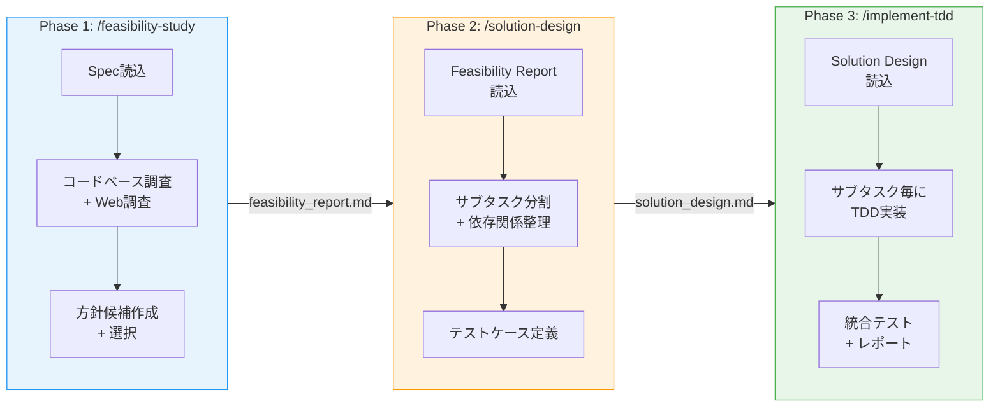
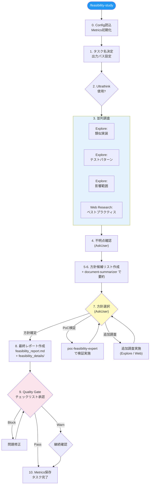
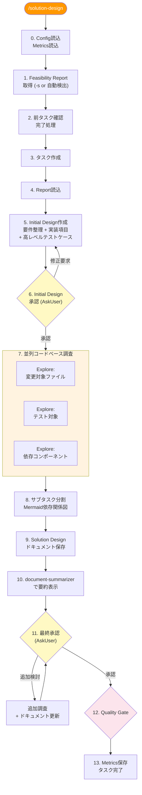
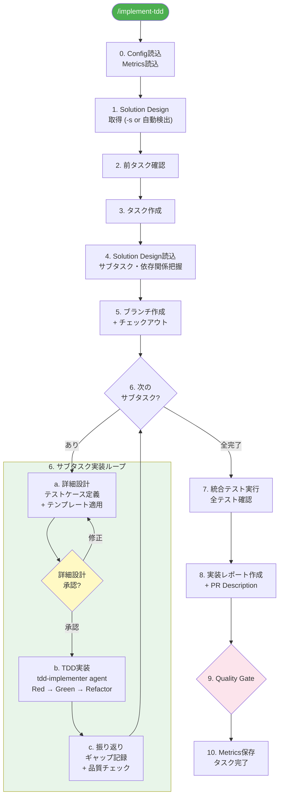
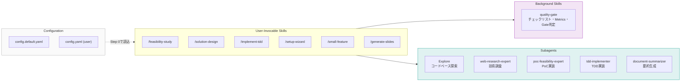

# app-dev-suite Workflow Diagrams

## 1. Overview

---

## 2. Detailed Flow

### Phase 1: Feasibility Study

### Phase 2: Solution Design

### Phase 3: TDD Implementation

### Supporting System

